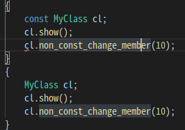

# const

1. const function cannot change member variables except "static variable".

2. distinguish const and non-const member function.  

3. even const function can change "mutable" variable; it's able to be used in case of "proxy" pattern.